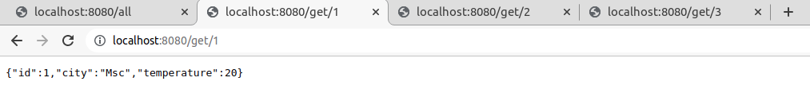
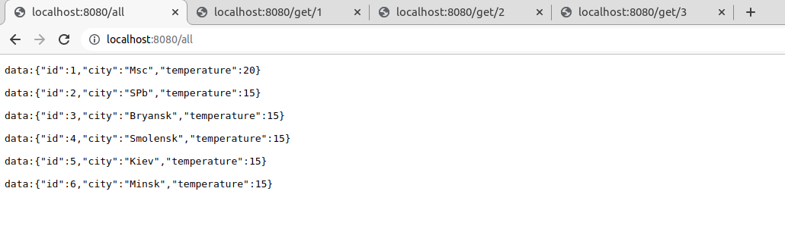

# Weather App

## О проекте

#### Описание
Веб приложение для отображения информации о прогнозе погоды.
Работает в режиме реактивного программирования. 
Для упрощения понимания данные хранятся в классе WeatherService 

#### Технологии
>JDK14, Maven, Spring Boot, Spring WebFlux, REST API

## Сборка
0. Скачайте исходники
2. Осуществите сборку приложения: `mvn clean install`
3. Запустите из консоли командой: `java -jar target/weather_reactive-1.0.jar`

## Как пользоваться
В приложении три запроса:
1. Показать список всех городов с погодой: `http://localhost:8080/all`
2. Показать детальную погоду по выбранному городу: `http://localhost:8080/get/{id}`
3. Показать самый жаркий город: `http://localhost:8080/hottest`

Чтобы приложение работало в реактивном режиме между слоями объекты нужно передавать в обертках Mono и Flux.
Mono - поток состоящий из одного элемента.
Flux - поток состоящий из набора объектов.
В сервисном слое и слое контроллера мы оборачиваем все объекты в соответствующие обертки.
Для демонстрации сервиса с долгой загрузкой, метод all использует задержку публикации данных.

## Контакты
Кутявин Владимир

skype: tribuna87

email: tribuna87@mail.ru

telegram: @kutiavinvladimir